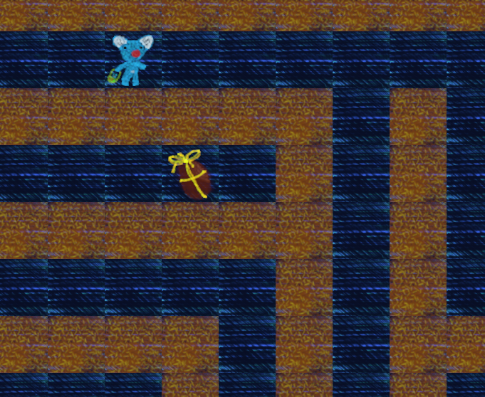

# so_long

My solution to the ```so_long``` project at 42 Paris.

Validated on jun-30 2023 with a score of 1️⃣0️⃣0️⃣ + 1 rating as outstanding project.

---

## Subject

### Summary

"This project is a very small 2D game.
Its purpose is to make you work with textures, sprites,
and some other very basic gameplay elements.
Objective : create a small 2D-game in C language."

### Map validity

    * Map file name must bear a **.ber** extension.
    * Map file contains only theses characters :
        1 = wall, 0 = floor, P = Player, C =collectible item, E = exit.
    * Valid map must be rectangular, surrounded by walls, contain only one player, one exit and at least one collectible item.
    * Valid path is checked : player should be able to collect all the items and can reach the exit.

### Gameplay

    * Player is controlled either with **A, W, S, and D keys** or by arrows.
    * Game's window should be minimized or closed with the **mouse control**.
    * At each player move, the total number of moves and the collected items status are displayed to the terminal standard output.
    * Explicit **Error messages** should appear and the game should exit properly. No leaks allowed.

### Usual rules

    * Makefile-related rules.
    * no forbidden functions
    * 42 norm compliance (tested with ```norminette```).
    * Memory management (no leaks allowed).

---

## Installation

```Makefile``` command ```make``` will compile the ```so_long executable``` that is dependent on the build of two libraries.

    * ```libmlx.a``` : the graphic library of the school.

    * ```libft.a```  : my own library of functions.

```make```will start to target the respective **Makefiles** for these two libraries.

### Minilibx installation

```MiniLibX``` : The graphic library used by so_long.

* To install **Minilibx** with ```make```:
    ```MLX_INTRA42``` variable in the ```Makefile``` has to be a valid URL for ```minilibx-linux.tgz``` ressource download. The URL is changing every month by 42 school. Be sure to update and check for its validity.

* Manual install **Minilibx** :
    ```minilibx-linux.tgz``` is present in the repo. Use these shell commands to unzip :

    $ tar -xvzf minilibx-linux.tgz $
    $ rm -f minilibx-linux.tgz $

### Libft for so_long

```Libft``` is the first project at 42 school, consisting of reproducing some C standard library functions. For ```so_long``` project, I have added the following functions.

    ```C
    char    *ft_strjoin_free(char *s1, char *s2);
    char    *get_next_line(int fd);
    char    **ft_free_split(char **strs);
    int     ft_strcountchr(const char *s, int c);
    ```

```get_next_line``` from the second project of the 42 curriculum, reads a line from a file descriptor. A modified version of ```ft_strjoin``` that frees allocated memory. ```ft_free_split``` frees a ```char **``` array. ```ft_strcountchr``` counts of a caracter occurence in a string.

---

## Execution

### prerequisite

```Makefile``` command ```make``` should install and display these 3 messages:

||
|---|
|making libft.a including bonus [OK]|
|making libmlx.a [OK]|
|making so_long executable [OK]|

From there, ```so_long``` executable takes one, and only one, argument : a **.ber map file**. Format for execution is ```./so_long <file.ber>```. For example :

    ```
    ./so_long ./maps/34_S_shaped_maze.ber
    ```

### Maps

Map ```.ber``` files can be found in the ```./maps/``` directory. Among which, many are not valid, on purpose, since they are intended for testing purposes during peer-reviewed evaluations.

Valid ```.ber``` maps in that directory have file name prefix numbers above 30, such as ```30_exit_blocks_the_c.ber```.

```so_long``` will control if a map is valid, checks for conformity to subject constrains. To check whether a ```player``` can reach all ```items``` and the```exit```, ```so_long``` also launches a pathfinding, based on a floodfilling algorithm.

### Screenshot



---

### Some useful links

[minilibx tutorial : 42 docs](https://harm-smits.github.io/42docs/libs/minilibx)

[Events/types](https://tronche.com/gui/x/xlib/events/types.html)

[man_mlx_loop](https://qst0.github.io/ft_libgfx/man_mlx_loop.html)

[Managing-events-with-the-minilibx](https://aurelienbrabant.fr/blog/managing-events-with-the-minilibx)

[Interrupting-or-killing-make]( https://makefiletutorial.com/#interrupting-or-killing-make)
